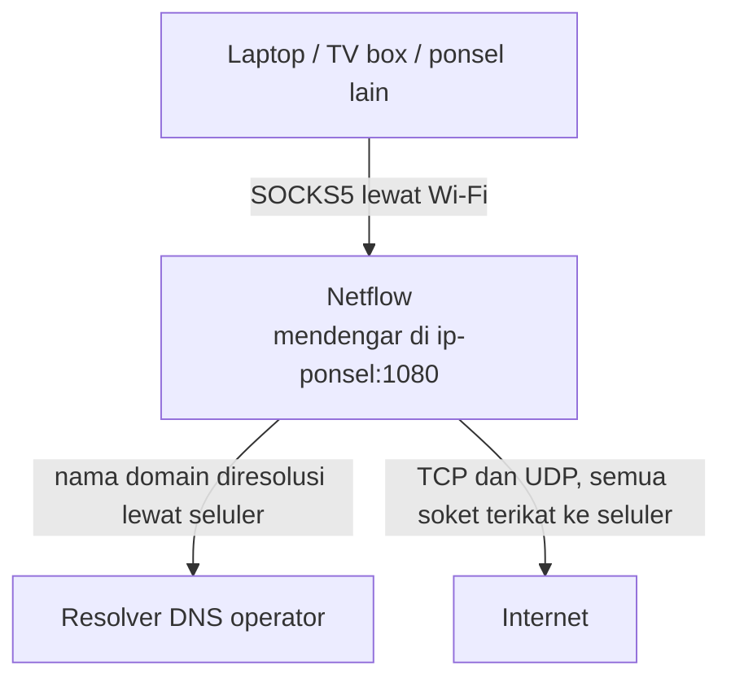
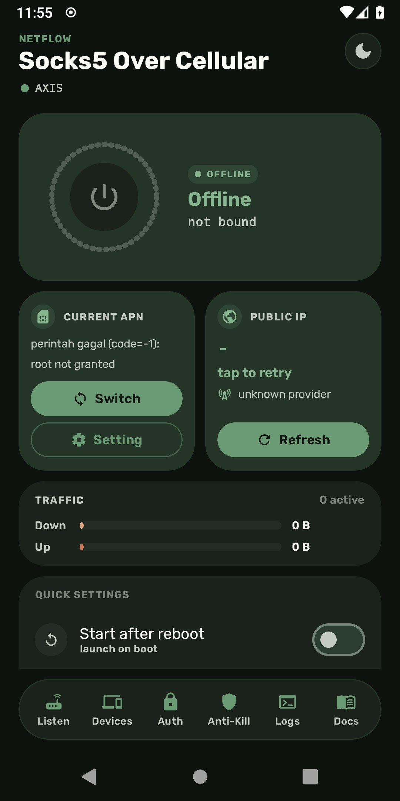
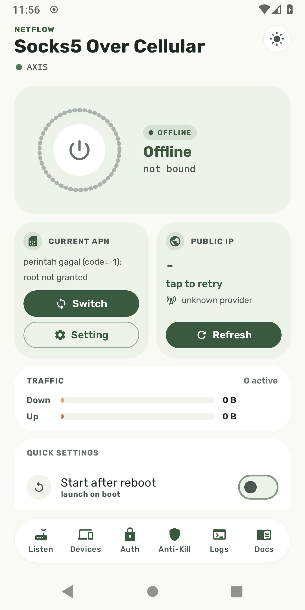
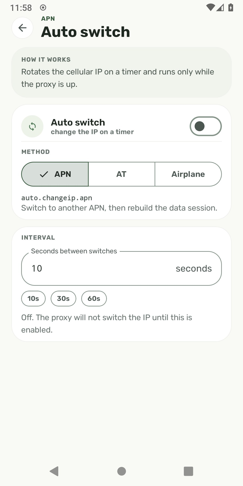
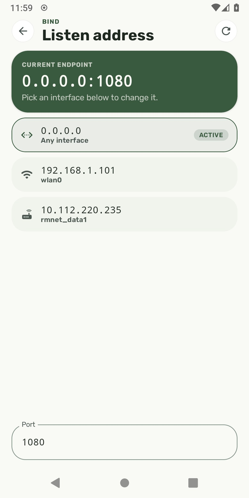
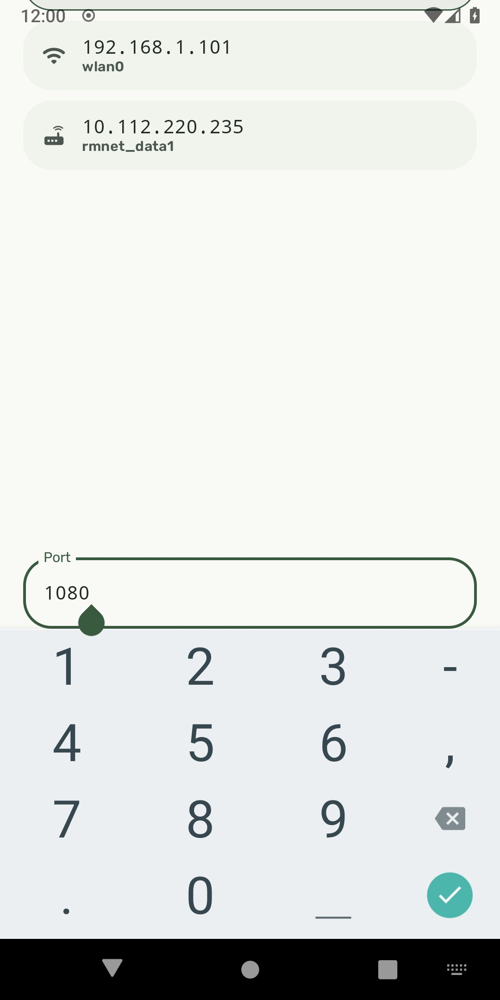

<div align="center">


# Netflow

SOCKS5 proxy untuk Android yang memaksa seluruh lalu lintas keluar lewat
jaringan seluler.

[](https://github.com/zengkuni/netflow/releases/latest)
[](LICENSE)
[](https://developer.android.com)
[](https://kotlinlang.org)

</div>

## Kegunaan

Netflow menjalankan server SOCKS5 di ponsel. Klien di Wi-Fi yang sama cukup
mengarah ke `ip-ponsel:1080`, dan setiap soket yang dibuka proxy ini terikat ke
jaringan seluler, apa pun jaringan yang dianggap default oleh Android.



Listener-nya tetap berada di antarmuka Wi-Fi supaya klien bisa menjangkaunya,
sementara TCP, UDP dan DNS semuanya keluar lewat seluler. Tidak ada layanan
VPN, tidak perlu root, tidak ada aturan iptables, dan tidak ada tethering.
Hanya soket yang dibuka Netflow yang terdampak; sisa ponsel tetap memakai
Wi-Fi seperti biasa.

<div align="center">
  
  
</div>

Tema gelap adalah tampilan bawaan. Tema terang tetap bisa dipilih dari tombol
tema di header, dan pilihannya tersimpan.

<div align="center">
  
  
  
</div>

## Pasang

Rilis terbaru: **v1.3**

Ambil `Netflow-v1.3.apk` dari
[Releases](https://github.com/zengkuni/netflow/releases/latest).
Membutuhkan Android 8.0 atau yang lebih baru.

## Cara pakai

1. Buka aplikasi dan beri izin yang diminta.
2. Pilih alamat listen dan port di **Listen** (bawaan `0.0.0.0:1080`).
3. Kalau perlu, isi username dan password di **Auth**.
4. Tekan tombol power.

Lalu arahkan klien ke IP ponsel pada port tersebut.

Pakai DNS remote supaya nama domain diresolusi lewat seluler, bukan di klien:

| Klien | Pengaturan |
|---|---|
| curl | `--socks5-hostname`, atau URL `socks5h://` |
| Firefox | aktifkan "Proxy DNS when using SOCKS v5" |
| Chrome | sudah memakai DNS remote untuk SOCKS5 |

## Bertahan di latar belakang

Android, khususnya Samsung, Xiaomi, Huawei dan OnePlus, akan mematikan proxy
latar belakang demi menghemat baterai. Layar **Anti-Kill** menunjukkan
pengaturan relevan mana yang belum diatur dan menaut langsung ke sana:
optimasi baterai, auto-launch, aktivitas latar belakang, dan kunci di Recents.
Aplikasi juga bisa menyalakan ulang proxy secara otomatis setelah reboot.

## Dukungan protokol

- `CONNECT` (TCP) dan `UDP ASSOCIATE`, sesuai RFC 1928
- Autentikasi username/password sesuai RFC 1929, bisa dinyalakan/dimatikan
  tanpa menyalakan ulang proxy
- Tipe alamat IPv4, IPv6 dan domain
- Nama domain diresolusi lewat server DNS milik jaringan seluler
- `BIND` belum diimplementasi dan mengembalikan `REP_COMMAND_NOT_SUPPORTED`

## API JSON-RPC (kontrol APN & rotasi IP)

Selama proxy berjalan, aplikasi juga membuka server **JSON-RPC 2.0** di
**port 9060**. Layar **Docs** di dalam aplikasi menampilkan cara pakai yang
sama secara interaktif.

Server ini hanya hidup selama proxy hidup: `ProxyService` yang menyalakannya
dan mematikannya bersamaan dengan proxy. Kalau proxy mati, port 9060 mati juga.

Transport menerima **dua bentuk pada port yang sama**, dideteksi dari byte
pertama request:

| Bentuk | Cocok untuk |
|---|---|
| `POST / HTTP/1.1` | `curl -X POST`, Python `requests`, hampir semua HTTP client |
| Satu objek JSON per baris, diakhiri `\n` | `nc`, skrip shell sederhana |

Setiap handler membalas envelope `{ok, error, data}`, jadi kegagalan perangkat
sekaligus kegagalan transport terbaca dari satu field, bukan dari exception.

```bash
# HTTP
curl -s -X POST http://ip-ponsel:9060 \
  -H 'Content-Type: application/json' \
  -d '{"jsonrpc":"2.0","id":1,"method":"apn.list"}'

# JSON per baris
printf '{"jsonrpc":"2.0","id":1,"method":"apn.list"}\n' | nc ip-ponsel 9060
```

Semua method memakai bentuk yang sama:

```json
// request
{"jsonrpc":"2.0","id":1,"method":"apn.current","params":{}}

// response
{"jsonrpc":"2.0","id":1,"result":{"ok":true,"error":null,"data":{ ... }}}
```

### Daftar method

| Method | Params | `data` saat sukses |
|---|---|---|
| `ping` | tidak ada | `"pong"` |
| `sim.active` | tidak ada | `{mnc, numeric}` |
| `apn.list` | `where` (opsional) | array objek APN |
| `apn.current` | tidak ada | objek APN, atau `null` |
| `apn.add` | `name`, `apn`, `mcc`, `mnc`, `numeric`, `type?`, `carrierEnabled?` | `null` |
| `apn.delete` | `id` **atau** `apn` | `null` |
| `apn.switch` | `id` | `null` |
| `auto.changeip.apn` | tidak ada | `{apn_active, apn_id, info}` |
| `auto.changeip.at` | tidak ada | `{info, detach_seen, radio_restored}` |
| `auto.changeip.airplane` | tidak ada | `{info, detach_seen, radio_restored}` |
| `root.granted` | tidak ada | `true` / `false` |

Objek APN yang dikembalikan `apn.list` dan `apn.current` (dan menjadi input
`id` untuk `apn.delete` serta `apn.switch`):

```json
{
  "id": 1234,
  "name": "XL Unlimited",
  "apn": "internet",
  "type": "default,supl",
  "mcc": "510",
  "mnc": "11",
  "numeric": "51011",
  "current": 1,
  "carrierEnabled": 1
}
```

Tiga method `auto.changeip.*` mengganti cara IP seluler diperbarui. Yang memakai
tabel APN (`auto.changeip.apn`) berputar antar-APN yang sudah ada; `at` dan
`airplane` melepas data lalu menyambung kembali, tanpa menyentuh tabel APN.

`where` pada `apn.list` disaring sebelum masuk ke perintah shell: hanya huruf,
angka, `_`, spasi, `= ! ' , . : ( )` yang diterima, maksimal 256 karakter.
`null` memakai filter bawaan; string kosong berarti "semua baris".

### Contoh

```bash
# APN yang sedang aktif
curl -s -X POST http://127.0.0.1:9060 \
  -d '{"jsonrpc":"2.0","id":1,"method":"apn.current"}'

# Tambah APN baru, lalu jadikan pilihan utama
curl -s -X POST http://127.0.0.1:9060 -d '{
  "jsonrpc":"2.0","id":2,"method":"apn.add",
  "params":{"name":"Operator 1","apn":"internet","mcc":"510","mnc":"01","numeric":"51001"}
}'
curl -s -X POST http://127.0.0.1:9060 \
  -d '{"jsonrpc":"2.0","id":3,"method":"apn.switch","params":{"id":1234}}'

# Rotasi IP lewat mode APN
curl -s -X POST http://127.0.0.1:9060 \
  -d '{"jsonrpc":"2.0","id":4,"method":"auto.changeip.apn"}'
```

Butuh root. Semua method APN menjalankan perintah shell root; tanpa root yang
diberikan, balasannya berupa kegagalan seperti
`{"ok":false,"error":"perintah gagal (code=-1): root not granted"}`. Cek dulu
dengan `root.granted` sebelum memanggil method lain.

Setiap kegagalan berbentuk `{"ok":false,"error":"<pesan>"}`, bukan HTTP error
status, sehingga satu field `error` sudah cukup untuk menangani kegagalan
perangkat maupun kegagalan transport.

### Keamanan

**API ini tidak berautentikasi dan mengikat ke `0.0.0.0`, bukan loopback.**
Artinya siapa pun yang bisa menjangkau port 9060 pada jaringan Anda bisa
menjalankan perintah root di ponsel. Pengikatan ke semua antarmuka adalah
keputusan operator agar API bisa dipanggil dari host atau LAN; kalau Anda hanya
memakainya dari ponsel itu sendiri, batasi dengan firewall atau pakai hanya
koneksi lokal. Jangan buka port ini ke internet.

## Keterbatasan

**IPv6 bergantung pada operator.** Kalau APN-nya hanya IPv4, jaringan seluler
tidak punya rute IPv6, sehingga tujuan yang hanya IPv4 saja pun sebenarnya
terjangkau tapi tujuan IPv6-only tidak. Proxy melaporkannya sebagai
network-unreachable, dan klien biasanya akan me-resolve nama itu sendiri lewat
jaringan lain yang bisa dijangkau.

**Proxy SOCKS5 tidak bisa menjamin privasi DNS.** Proxy hanya melihat nama yang
dipilih klien untuk dikirim kepadanya. Kalau klien me-resolve nama domain
secara lokal lalu menyambung lewat IP, lookup itu tidak pernah sampai ke ponsel.
Aktifkan DNS remote di klien.

## Izin

| Izin | Alasan |
|---|---|
| `INTERNET` | Soket keluar |
| `ACCESS_NETWORK_STATE` | Meminta dan menahan handle jaringan seluler |
| `FOREGROUND_SERVICE`, `FOREGROUND_SERVICE_SPECIAL_USE` | Tetap jalan saat layar mati |
| `POST_NOTIFICATIONS` | Notifikasi status (Android 13+) |
| `READ_BASIC_PHONE_STATE` | Nama operator dan jenis radio di header |
| `RECEIVE_BOOT_COMPLETED` | Opsi mulai otomatis setelah reboot |
| `WAKE_LOCK` | Menahan CPU tetap aktif saat mem-proxy |
| `REQUEST_IGNORE_BATTERY_OPTIMIZATIONS` | Meminta aplikasi dikecualikan dari Doze |

Tidak ada data yang dikumpulkan atau dikirim ke mana pun. Penghitung lalu
lintas dan daftar perangkat hanya disimpan di memori dan di-reset saat proxy
berhenti.

## Membangun

```bash
./gradlew :app:assembleRelease
```

Butuh JDK 17 dan Android SDK 36. Signing bersifat opsional: tanpa keystore di
`app/keystore/netflow-release.jks`, proses build tetap menghasilkan APK tanpa
tanda tangan.

## Lisensi

MIT. Lihat [LICENSE](LICENSE).
